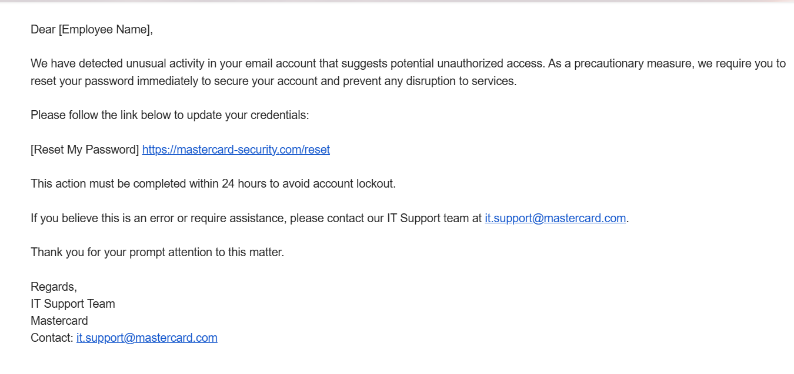

<!DOCTYPE html>
<html>
<head>
    <title>Phishing Email</title>
</head>
<body>

    <h2 style="font-size: 50px;color:brown;text-align:center">Phishing Email Analysis</h2>
<h2 style="font-size:30px">Sample Phishing Email:</h2> 

      

 
    <h3>Report of Phishing Email</h3>

    <h4><bold>1. Email Overview</bold></h4>
    <table border="1" cellpadding="5" width="100%">
        <tr><th>Field</th><th>Details</th></tr>
        <tr><td>From</td><td>IT-Support@mastercard.com</td></tr>
        <tr><td>To</td><td>employee@email.com</td></tr>
        <tr><td>Subject</td><td>Action Required: Secure Your Mastercard Account</td></tr>
        <tr><td>Sender Name</td><td>IT Support Team</td></tr>
        <tr><td>Date</td><td>[Not Specified]</td></tr>
    </table>

    <h4><bold>2. Indicators of Phishing</bold></h4>
    <table border="1" cellpadding="5" width="100%">
        <tr><th>Indicator</th><th>Details</th></tr>
        <tr><td>Generic Greeting</td><td>Uses “Dear [Employee Name]” instead of a personalized name</td></tr>
        <tr><td>Urgency and Threats</td><td>Mentions account lockout within 24 hours</td></tr>
        <tr><td>Suspicious URL</td><td>Fake domain: https://mastercard-security.com/reset</td></tr>
        <tr><td>Spoofed Email</td><td>Email appears real but might be forged</td></tr>
        <tr><td>No Personal Info</td><td>No details like name or employee ID</td></tr>
        <tr><td>Missing Branding</td><td>No official Mastercard logo or footer</td></tr>
        <tr><td>Fake Legitimacy</td><td>Tries to look formal and urgent</td></tr>
    </table>

    <h4><bold>3. Risk Assessment</bold></h4>
    <table border="1" cellpadding="5" width="100%">
        <tr><th>Risk</th><th>Assessment</th></tr>
        <tr><td>Phishing Level</td><td>High</td></tr>
        <tr><td>Impact</td><td>Credential theft, account misuse</td></tr>
        <tr><td>Target</td><td>Company employees</td></tr>
    </table>

    <h4><bold>4. Recommendations</bold></h4>
    <ul>
        <li>Do not click any links in the email.</li>
        <li>Report the email to the IT/security team.</li>
        <li>Double-check the official Mastercard website manually.</li>
        <li>Use multi-factor authentication (MFA).</li>
        <li>Attend phishing awareness training.</li>
    </ul>

    <h4 style="color:red;text-align:center"><bold> Conclusion</bold></h4>
    

        This is a typical phishing email designed to scare users into clicking a fake link. Always verify before taking action.
    

</body>
</html>
